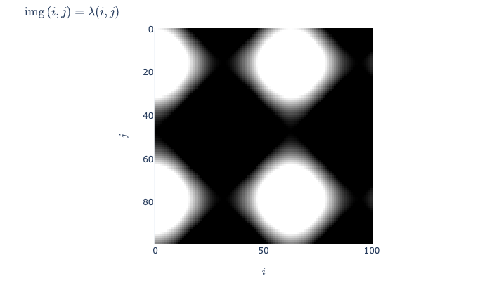

## Sunpy-Kamodo

Building a high-level functional layer for interoperability with PyHC, data-model comparisons, and executable manuscripts.


### Why are you doing this?

By "Kamodofying" sunpy, we can extend Sunpy's capabilities:
1. Enable data-model comparisons
1. $f$unctional access Sunpy's underlying data structures and transformations
1. Make amenable to functional programming techniques.
1. Data mining/machine learning applications
1. High-level workflows for lay audiences.
1. Enable interoperability with alternative plotting libraries (e.g. plotly)
1. Automated plots, dashboards
1. Composability with other PyHC projects
1. More generally: Interoperability with a growing ecosystem of functionalized space weather resources


## Kamodo, in brief

Kamodo provides a generic, symbolic interface to functionalized data resources.
* @kamodofy decorator
* Dictionary-like function registration
* Functions may be manipulated with python or latex expressions
* Function composition
* Explicitly unit conversion
* Kamodo uses function inspection to produce quick-look graphics

```python
from kamodo.plotting import plot_types
plot_types
```

<!-- #region -->
## Getting Started

Sunpy-Kamodo hosted on Github

https://github.com/EnsembleGovServices/kamodo-sunpy

#### Docker

If you have docker installed:

```sh
docker run -p 8889:8888 -it apembroke/kamodo-sunpy 
```

#### Conda

This is basically the same as the docker version
```sh
conda config --add channels conda-forge
conda config --set channel_priority strict
conda install sunpy

pip install kamodo

conda install jupytext jupyter
```
<!-- #endregion -->

### Sunpy Kamodofication (Based on Intro_to_sunpy notebooks)

We say that a data resource has been "kamodofied" when all scientifically relevant fields have been registered as functions with appropriate units, citation information, etc. Typically, this done through a subclass of Kamodo tailored for that use case. For example, when raw data is involved, the kamodo subclass should be responsible for 1)  interacting with any interfaces (e.g. PyHC  projects) required to access the data, and 2) register data interpolators as functions intended for scientific analysis. 


### Kamodo-core now supports images


```python
import numpy as np
from kamodo import Kamodo, kamodofy
@kamodofy
def img(i=np.arange(100),j=np.arange(101)):
    ii, jj, kk = np.meshgrid(i,j,[100, 200, 255], indexing='ij')
    return 255*(np.sin(.1*ii)+np.cos(.1*jj))

kamodo = Kamodo(img=img)
fig = kamodo.plot('img')
```

```python
fig.write_image('kamodo_test_image.png')
```



```python
kamodo.img(3,3)
```

## Kamodofying SkyCoord tranforms

```python
import astropy.units as u
from astropy.coordinates import SkyCoord
import sunpy.coordinates
from kamodo import Kamodo, kamodofy
import numpy as np
```

base kamodo instance, to be updated

```python
kamodo = Kamodo() 
```

Define a function that can interact with SkyCoord objects

```python
@kamodofy(equation = "\lambda(\delta_{hpc},\\alpha_{hpc}, t_{unix})",
          units='km',
          arg_units=dict(alpha_HPC='arcsec', delta_HPC='arcsec', t_unix='s'))
def xvec_HGS(alpha_HPC, delta_HPC, t_unix):
    """Converts from helioprojective to heliographic_stonyhurst"""
    hpc = SkyCoord(alpha_HPC, delta_HPC,
                   unit='arcsec',
                   obstime=t_unix,
                   observer="earth",
                   frame="helioprojective")
    
    hgs = hpc.transform_to("heliographic_stonyhurst")
    xvals = hgs.cartesian.x.value
    yvals = hgs.cartesian.y.value
    zvals = hgs.cartesian.z.value
    return np.array([xvals, yvals, zvals])
```

register functionalized coordinate transform

```python
kamodo['xvec_HGS'] = xvec_HGS
kamodo
```

```python
help(kamodo.xvec_HGS)
```

```python
lon = np.linspace(0, 5, 5)
lat = np.linspace(0, 5, 7)

llon, llat = np.meshgrid(lon, lat)

llon.shape, llat.shape
```

test that lon-lat -> x,y,z works as expected

```python
kamodo.xvec_HGS(llon, llat, '2020/12/15T00:00:00')
```

### Changing observers

Brainstorm: The below functions could be auto-generated and preregistered by a skyKamodo subclass

```python
hpc_earth = sunpy.coordinates.Helioprojective(observer="earth", obstime="2017-07-26")

hpc_venus = SkyCoord(0*u.arcsec, 0*u.arcsec, observer="venus", obstime="2017-07-26", frame="helioprojective")

@kamodofy(units='AU', arg_units=dict(lon_venus='arcsec', lat_venus='arcsec', t_obs='s'))
def xvec_earth(lon_venus, lat_venus, t_obs):
    """transforms from Venus sky coordinates to Earth cartesian"""
    hpc_earth = sunpy.coordinates.Helioprojective(observer="earth", obstime=t_obs) # z is toward the sun
    hpc_venus = SkyCoord(lon_venus, lat_venus,
                         observer="venus",
                         unit='arcsec',
                         obstime=t_obs,
                         frame="helioprojective")
    hpc = hpc_venus.transform_to(hpc_earth)
    
    return np.array([hpc.cartesian.x.value, hpc.cartesian.y.value, hpc.cartesian.z.value])

kamodo['xvec_earth'] = xvec_earth
kamodo
```

```python
kamodo.xvec_earth.meta.get('rhs', kamodo.xvec_earth)

kamodo.xvec_earth(3,3, '2020/12/3')
```

## Kamodofying sunpy map object

```python
import matplotlib.pyplot as plt

from sunpy.data.sample import AIA_171_IMAGE
import sunpy.map
```

```python
aiamap = sunpy.map.Map(AIA_171_IMAGE)
aiamap
```

```python
from kamodo import gridify

kamodo = Kamodo(verbose=False)

@kamodofy(units='arcsec')
def alpha_AIA(ivec):
    """pixel to longitude"""
    i, j = ivec
    return aiamap.wcs.pixel_to_world(i,j).spherical.lon.value
kamodo['alpha_AIA'] = alpha_AIA

@kamodofy(units='arcsec')
def pixel_to_latitude(ivec):
    """pixel to latitude"""
    i, j = ivec
    return aiamap.wcs.pixel_to_world(i,j).spherical.lat.value
kamodo['delta_AIA'] = pixel_to_latitude

def xvec(ivec):
    """converts from pixels to Cartesian world coordinates.
    
    the output is normalized
    """
    i, j = ivec
    xvec_ = aiamap.wcs.pixel_to_world(i,j).cartesian
    x, y, z = xvec_.x.value, xvec_.y.value, xvec_.z.value
    return np.array([x,y,z])

kamodo['xvec_AIA'] = xvec

kamodo
```

```python
help(kamodo.delta_AIA)
```

```python

```

```python
def get_bbox(kamodo):
    """get bounding box from alpha, delta (arseconds)"""
    delta_min, delta_max, alpha_min, alpha_max = np.nan*np.ones(4)
    imax, jmax = aiamap.data.shape
    for i in [0, imax-1]:
        for j in [0, jmax-1]:
            alpha_ = kamodo.alpha_AIA((i,j))
            delta_ = kamodo.delta_AIA((i,j))
            alpha_min = np.nanmin([alpha_min, alpha_])
            alpha_max = np.nanmax([alpha_max, alpha_])
            delta_min = np.nanmin([delta_min, delta_])
            delta_max = np.nanmax([delta_max, delta_])
            print(alpha_min, alpha_max, delta_min, delta_max)

    return np.array([[alpha_min, alpha_max], [delta_min, delta_max]]).T

bbox = get_bbox(kamodo)

@kamodofy(arg_units=dict(alpha='arcsec', delta='arcsec'))
@gridify(alpha = np.linspace(*bbox[0], 51), delta = np.linspace(*bbox[1], 53), order='A')
def ivec(alphavec):
    """Gives the pixel coordinates for given longitude and latitude"""
    alpha_, delta_ = alphavec.T
    sky = SkyCoord(alpha_, delta_, unit='arcsec',
               frame=aiamap.coordinate_frame)
    result = np.array(aiamap.wcs.world_to_pixel(sky))
    return np.ma.masked_less(result, 0).astype(int)

kamodo['ivec_AIA'] = ivec
```

```python
kamodo
```

```python
@kamodofy(units='')
def I_px(ivec_px):
    """The image as a function of pixel indices
    input can be shape (2,3,4) or a 2-tuple of arrays of shape (3,4), (3,4)
    """
    i, j = ivec_px
    return aiamap.data[i, j]

kamodo['I_px'] = I_px
kamodo['i_px(alpha,delta)'] = 'I_px(ivec_AIA)' # composition
kamodo
```

```python
kamodo

bbox[0,1]-bbox[0,0]

bbox[1,1]-bbox[1,0]

ds = bbox[0,1]-bbox[0,0]

np.linspace(bbox[0,0] + ds/2, bbox[0,0] + ds/2 + ds/10, )

np.arange(bbox[0,0] + ds/2, step=ds/10)
```

```python
alpha = np.linspace(-250, 250, 200)

delta = np.linspace(0, 500, 200)
```

```python
kamodo
```

```python
kamodo.i_px(alpha, delta).shape
```

```python
help(kamodo.i_px)
```

```python
alpha = np.linspace(-400, 400, 800)
delta = np.linspace(-400, 400, 800)

fig = kamodo.plot(i_px = dict(alpha=alpha,
                        delta=delta))

fig
```

```python
aiamap
```

We have also done some experiments kamodofying the SkyCoord class:
* can register with units by wrapping transform_to
* need a Kamodo subclass that pre registers various coordinate permutations upon instantiation

World Coordinate System:
* Need a kamodoMap subclass
* built wrapper for pixel_to_world
* registered pixel functions with sample kamodo objects

Todo:
* start a separate repo for Sunpy-Kamodo interfaces
* containerization for dev/production
* what workflows can we simplify?
* what opportunities are there to combine with other Kamodofied resources?

```python

```
