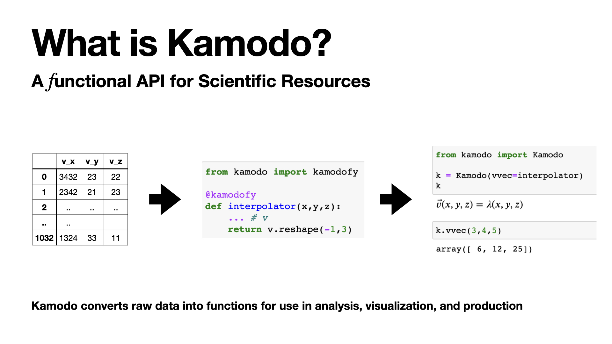

# Introduction to Kamodo

### PyHC Summer School / Jun 3 2022 / ESAC, Madrid, Spain
Asher Pembroke (DBA/Ensemble) w/Ensemble LTD in partnership with CCMC

Special Thanks: Laura Hayes

### What is a scientific resource?

Mirriam-Webster Definition of resource:

    1. a source of information or expertise

Scientific resources are 

* Observables on a well-defined domain of scientific interest
* Can be purely functional (coordinate systems, expressions)
* Often associated with units of measure (e.g. kg/m^3)
* Intended for downstream users

Scientific resources **are not** the tools themselves:

* Specific file formats (e.g. hdf, cdf, netcdf)
* specific APIs
* Raw model output or observational data

### What are functions?

> In mathematics, a function from a set X to a set Y assigns to each element of X exactly one element of Y. The set X is called the domain of the function and the set Y is called the codomain of the function. - Wikipedia

* A function is uniquely represented by the set of all pairs (x, f (x)) (a.k.a. the [graph](https://en.wikipedia.org/wiki/Graph_of_a_function) of a function)
* Colloquially, **functions take inputs and return outputs**

Functions represent *mappings*, they **are not** the tools themselves:
* Expressions: `f(x,y,z) = x**2+y**2+z**2`
* Code blocks: `lambda x,y,z: x**2 + y**2 + z**2`
* Variables: `rho` (the codomain) is not the same as `rho(x)` (the function)

### Why are functions so important?

Functions represent the physical state of the systems we are investigating
* Fields (Electromagnetic, fluid, etc)
* Derived variables (e.g. $ P_{ram} = \rho v^2 $)
* Coordinate transformations
* Images (pixel coordinates)
* **solutions** to differential equations

Functions may readily be used downstream:
* Evaluation
* Composition
* Graphing
* Pipelining

<!-- #region -->
### What is an API?

> An application programming interface (API) is a connection between computers or between computer programs... One purpose of APIs is to **hide the internal details of how a system works, exposing only those parts a programmer will find useful** and keeping them consistent even if the internal details later change. - Wikipedia

APIs help us communicate with data living in:

* databases (REST, SQL)
* file formats (hdf, netcdf)
* libraries

### What is *functional* API?

A *functional API* focuses on provides access to information in the form of functions, rather than the underlying data or objects themselves.

* low barrier to entry
* (mostly) self-describing
* (almost) no side effects
* ammenable to functional programing techniques
* compatible with AI/ML

<!-- #endregion -->
